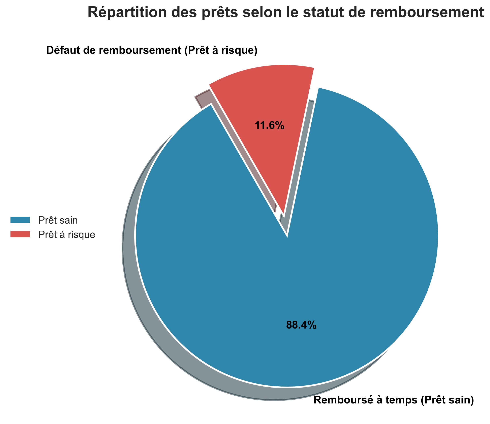
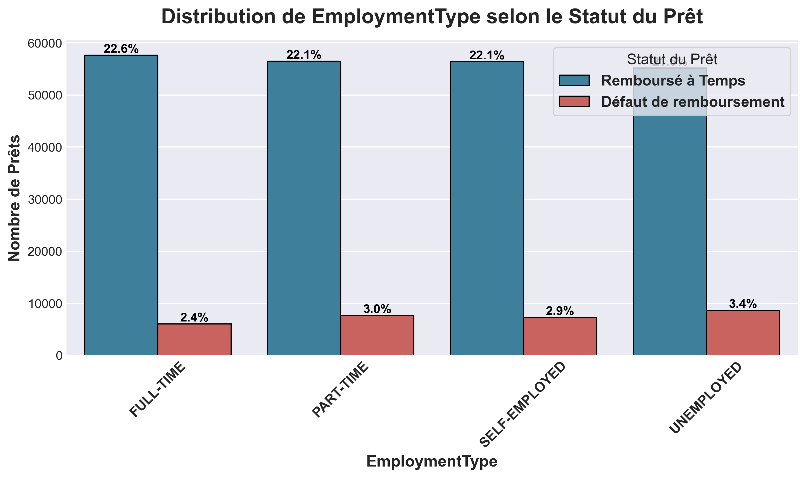
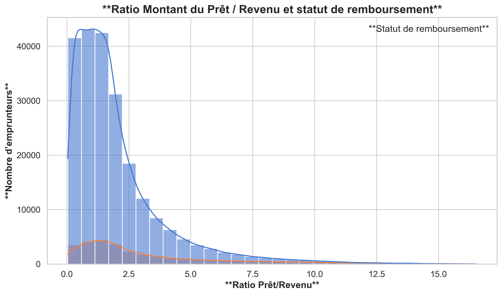
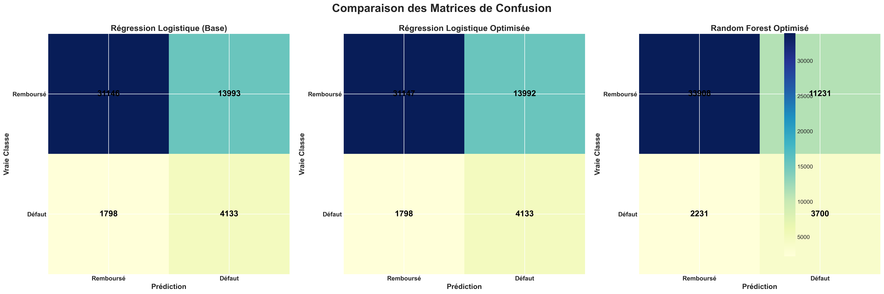
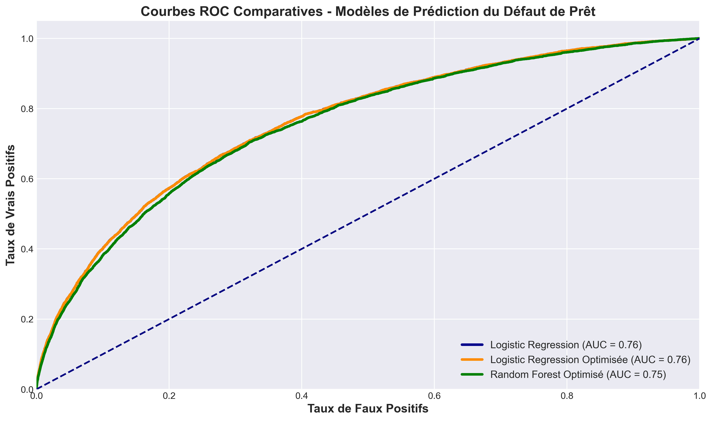
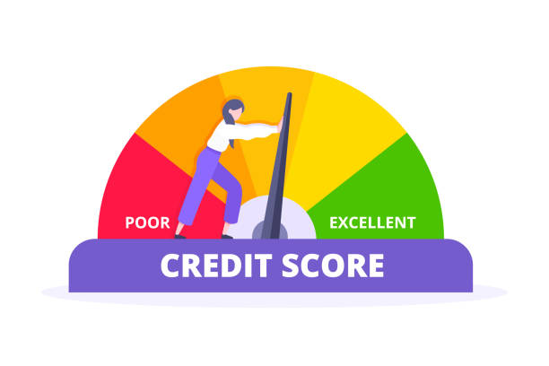

# **Akademi Education - Data Science & IA - Cohorte (2025)**
---
- ### **Phase 5 :** Capstone Project Dr Science Des Données 
- ### **Noms des étudiants du groupe :** Vilmarson JULES & Rodolphe Charles  
- ### **LinkedIn:** [Vilmarson JULES](https://www.linkedin.com/in/jules-vilmarson-2a68a5294/) | [Rodolphe CHARLES](https://www.linkedin.com/in/rodolphe-charles-81b75924b?utm_source=share&utm_campaign=share_via&utm_content=profile&utm_medium=android_app)
- ### **Noms des instructeurs :** Wedter JEROME et Geovany Batista Polo LAGUERRE  
- ### **Rythme d’apprentissage :** Autonome  
- ### **Date de soutenance :** 28 octobre 2025   
> - ### **Lien GitHub du projet :** [Prédiction du Risque de Défaut de Prêt](https://github.com/VilmarsonJ/Loan-Default-Risk-Prediction.git)
---


# **Prédiction du Risque de Défaut de Prêt pour les Institutions Financieres**
---
### ***Une étude basée sur les données pour évaluer le risque de crédit et optimiser les décisions de financement***


> #### **Akademi Education – Octobre 2025**

## **Brève Description**
---
Les défauts de remboursement constituent un **défi majeur pour les banques**, affectant **la rentabilité**, **la stabilité financière** et **l’accès au crédit**. Évaluer efficacement quels candidats sont susceptibles de faire défaut est essentiel pour **réduire les risques** et **prendre des décisions de prêt éclairées**. Cette étude utilise des **modèles de machine learning** pour prédire le risque de défaut de remboursement des prêts. 

- ### ***Les objectifs principaux de ce projet sont :***
**1. Prédire le risque de défaut de prêt** afin de gérer de manière proactive les emprunteurs à haut risque.  
**2. Soutenir les décisions stratégiques de prêt** grâce à des **insights exploitables**.  
**3. Réduire les prêts non performants (NPL)** et améliorer la **stabilité financière globale**.  
**4. Améliorer les processus d’évaluation du crédit** par une analyse **basée sur les données**.

Les insights issus de cette analyse contribuent à **réduire les prêts non performants**, **optimiser les stratégies de prêt** et **renforcer la stabilité financière globale**, démontrant l’impact concret de l’analytics prédictive dans le secteur bancaire.


## **Problématique du Crédit**
---


Les institutions financières font aujourd’hui face à une montée significative du risque de défaut de prêt, conséquence directe de l’instabilité économique et de la diversité croissante des profils d’emprunteurs. Les approches traditionnelles d’évaluation du crédit, souvent fondées sur des critères statiques et linéaires, ne suffisent plus à appréhender la complexité des comportements financiers actuels. Dans ce contexte, il devient essentiel pour ces institutions de recourir à des méthodes analytiques et prédictives capables d’exploiter les données historiques de prêts afin d’identifier de manière précoce les emprunteurs à risque. 

### **Problème central :**  Comment les institutions financières peuvent-elles exploiter les données historiques de prêts pour prévenir les défauts de paiement, optimiser la gestion des risques et améliorer la prise de décision en matière de crédit pour différents profils d’emprunteurs ?

**Résoudre ce problème permet aux banques et prêteurs de :**  
- Prendre des **décisions de prêt basées sur les données**.  
- Concevoir des **interventions ciblées** pour les emprunteurs à risque.  
- Réduire les **pertes financières** et **stabiliser les portefeuilles de prêts**.  
- Soutenir les initiatives de **gestion stratégique et réglementaire du risque**.  

> Ce projet aborde cette problématique en exploitant des **données historiques sur les prêts et les clients** avec des **modèles de machine learning**, transformant des patterns complexes en insights exploitables pour **prévenir les défauts avant qu’ils ne surviennent**.


## **Methods**
---

Nous avons adopté une approche de data science orientée “Predictive Analytics”, centrée sur une classification binaire visant à prédire si un emprunteur fera défaut ou non sur son prêt.
***Nous nous appuyons sur un écosystème Python robuste pour la data science, incluant :***  
- **Data manipulation & analysis :** `pandas`, `numpy`  
- **Visualization :** `matplotlib`, `seaborn`  
- **Machine learning :** `scikit-learn`, `xgboost`, `lightgbm`  
- **Environment & version control :** Git, GitHub, Jupyter Notebook  

***Nous avons poursuivi ces etapes qui ci-dessous pour realiser cette etude :***
- Data Understanding
- Data Cleaning
- Exploratory Data Analysis (EDA)
- Data Preprocessing & Feature Engineering
- Modeling
- Insights & Interpretation


## **Comprenension du Business**
---

Les défauts de paiement représentent un défi majeur pour les institutions financières dans le mondes, en particulier celles des haitiens, impactant la **rentabilité, le risque de crédit et la stabilité financière**. 
Cette étude se concentre sur le contexte des ***services bancaires et financiers***, avec des applications dans **l’évaluation du risque de crédit, la stratégie de prêt et la conformité réglementaire dans le monde, en particulier en Haiti**.

#### ***Le public cible principal comprend :***  
- **Banques et institutions financières :** optimiser les prêts et réduire les pertes.  
- **Banques centrales et régulateurs :** surveiller et gérer le risque systémique.  
- **Fintech et prêteurs :** mettre en œuvre des processus d’approbation de crédit basés sur les données.  

#### ***L’impact concret de ce projet est significatif :***  
**1.** **Réduire les prêts non performants (NPLs)** et minimiser les pertes financières.  
**2.** Fournir des **scores de risque pour chaque emprunteur** afin de guider les décisions de prêt.  
**3.** Permettre des **interventions ciblées** pour les emprunteurs à risque de défaut.  
**4.** Soutenir les **rapports réglementaires** et renforcer la **stabilité financière globale**.

> La **motivation** de ce projet est de montrer comment la **data science peut transformer les pratiques de prêt traditionnelles**, améliorer la qualité des décisions de crédit et apporter une **valeur business tangible** aux institutions financières, régulateurs et prêteurs.


### **Comprehension des données**
---

Le jeu de données utilisé dans ce projet provient du **[Loan Default Prediction Challenge](https://www.kaggle.com/datasets/nikhil1e9/loan-default?)** sur Kaggle, basé sur un cas réel de prédiction de défaut de crédit.
. Il représente des **données financières réelles de prêts** provenant de banques et d’institutions de crédit accordant des prêts aux particuliers et aux entreprises. 
Il contient plus de 255 000 prêts individuels, chacun représentant un emprunteur unique et ses caractéristiques financières, sociales et comportementales.

- Variables financieres : revenu, Ratio dette/Revenu, Cote de credit
- Variables relatives au prêts : Montant du prêts, taux d'interet, duree du prêts, objet du  prêts
- variable cible : Defaut de paiment
- Variables Socio-demographiques : Age, Niveau d'education, Statut matrimonial, Type d'emploi


## **Exploratory Data Analysis (EDA)**
---
L’Analyse Exploratoire des Données (EDA) permet de **mettre en évidence les facteurs de risque**, d’identifier **les tendances et anomalies**, et de préparer le terrain pour la **modélisation prédictive**
Cette étape nous a permi de comprendre en profondeur :

- la distribution du Type d'emploie, Niveau d'education, Objet du  prêts selon le statut de remboursement.
- Les corrélations entre variables financières  Revenu, Montant du  prêt, cote de credit.
- Les facteurs de risque les plus associés aux défauts.
- Enfin la repartition  du  selon le statut de remboursement.



Environ 88,4 % des emprunteurs remboursent leurs prêts à temps, tandis que 11,6 % font défaut.
Bien que minoritaire, cette proportion représente un risque financier significatif pour les institutions financiereres. Identifier proactivement ces emprunteurs peut prévenir des pertes et stabiliser le portefeuille de prêts.


Les emprunteurs **indépendants ou à temps partiel** présentent un taux de défaut légèrement supérieur à celui des **employés à temps plein**, indiquant que la **stabilité des revenus** est un facteur clé pour le remboursement. Les banques pourraient en tenir compte lors de l’approbation des prêts ou pour ajuster les taux d’intérêt selon le profil de risque.




L’analyse révèle qu’un **ratio prêt/revenu supérieur à 2,5** constitue un **seuil critique de risque**: les emprunteurs dépassant ce niveau affichent une probabilité de défaut nettement accrue, tandis que ceux situés **entre 0,5 et 2,5** représentent **près de 70 % du portefeuille** et maintiennent un comportement de remboursement stable.

> Cette information peut orienter les institutions financières vers une **segmentation du risque plus fine, une politique d’octroi optimisée, et une stratégie de tarification différenciée** pour maximiser la **rentabilité tout en maîtrisant le risque de défaut.**

 ## **Modélisation**
 ---
Nous avons construit et évalue des **modèles de machine learning** pour prédire le risque de défaut de remboursement des prêts.

#### ***1. Logistic Regression (Baseline)***
#### ***2. Optimized Logistic Regression***
#### ***3. Optimized Random Forest***

Pour chacun des trois models ci-dessus, nous avons suivent les demarches suivantes necessaires de l'entrainement des modeles jusqua selectionner le meilleur modele.
De ce fait, nous avons suivre les etapes suivant :

- Création des pipelines ML( Scaling, encodage)
- Division des donness(20% pour test)
- Gestion du déséquilibre des classes
- Entrainement
- Optimisation des hyperparamètres via GridSearch
- Selection du meilleur modele


## **Evaluation des modeles**
---
- ### ***Indicateurs de performance***


Après avoir construit et évalué nos modèles principaux , **Régression Logistique Optimisée** et **Random Forest Optimisé** , nous pouvons comparer leurs performances et comprendre leurs rôles spécifiques dans la prédiction du risque de défaut.




#### ***Métriques d'évaluation***


| Modèle | Accuracy | Precision | Recall | F1-score | AUC |
|:-------|:---------:|:----------:|:--------:|:----------:|:----:|
| Régression Logistique Optimisée (identique à la baseline) | 0.69 | 0.23 | 0.70 | 0.34 | 0.76 |
| Random Forest Optimisé | 0.73 | 0.25 | 0.63 | 0.35 | 0.75 |



- ### **Sélection et Sauvegarde du Modèle**

**Après avoir évalué tous les modèles, nous avons sélectionné le **Random Forest optimisé** pour sa **meilleure performance globale** (AUC et métriques clés).**  

- **Modèle sélectionné :** Random Forest  
- **Fichier sauvegardé :** `../Models/model_final.joblib`  
- **Outil utilisé :** `joblib` pour sauvegarder le modèle entraîné, permettant de **recharger et réutiliser rapidement** le modèle sur de nouvelles données.  

> Cette approche garantit que le modèle peut être reproduit et appliqué directement dans un contexte opérationnel.

- ### **Déploiement du Modèle (Next Steps)**

Pour rendre le modèle accessible aux utilisateurs finaux, nous avons exploré le **déploiement avec Streamlit**, afin de créer une **interface web interactive** permettant :  
- La saisie de nouvelles données clients  
- L’affichage instantané du **score de risque de défaut**  
- **Statut actuel :** Application Streamlit initialisée et testée localement, avec quelques ajustements à finaliser.  
- **Prochaine étape :** Optimiser et déployer l’application pour un accès utilisateur fluide (local ou serveur cloud).  

> Même si le déploiement complet n’est pas encore finalisé, cette étape montre que le modèle est **prêt pour une intégration opérationnelle**, illustrant la capacité à transformer un modèle ML en **outil concret pour la prise de décision**.

## **Principaux Resultats**
---
Le projet de prédiction du risque de défaut de paiement fournit des insights exploitables pour les institutions financières souhaitant optimiser leurs décisions de crédit et réduire les pertes liées aux prêts non performants :

- **Risque concentré sur une minorité d’emprunteurs :**  
  Bien que la majorité des clients remboursent leurs prêts à temps, environ **12% présentent un risque de défaut élevé**. Ces clients représentent un **impact financier disproportionné** et doivent être surveillés proactivement.

- **Performance robuste du modèle Random Forest :**  
  Le modèle Random Forest Optimisé fournit une **précision élevée et un score AUC solide**, permettant d’identifier les emprunteurs à risque de manière fiable. Il capture efficacement les relations complexes entre caractéristiques financières, démographiques et comportementales des clients.

- **Insights pour l’allocation des ressources :**  
  Les scores prédictifs peuvent guider les équipes de crédit dans la **priorisation des dossiers critiques**, l’**ajustement des termes de prêt**, et la mise en place de **mesures préventives ciblées** pour réduire le risque global du portefeuille.

- #### **Impact Institutionnel :**  
En combinant surveillance proactive, interventions ciblées et communication adaptée, les institutions financières peuvent :  
  **1. Réduire les pertes liées aux prêts non performants.**  
  **2. Maintenir la relation client et la fidélisation.**  
  **3. Optimiser l’allocation des ressources humaines et financières pour un meilleur ROI.**

## **Recommandations d'affaires**
---
***Pour réduire le risque de défaut de paiement et optimiser les décisions de crédit, voici les recommandations clés basées sur notre analyse :***

#### 1. Renforcer la Gestion du Risque Client :
- Identifier les emprunteurs à haut risque dès la demande  
- Mettre en place un suivi différencié

#### 2. Optimiser les Décisions de Crédit et la Rentabilité :
- Décisions basées sur les données  
- Gestion stratégique du portefeuille

#### 3. Développer une Stratégie de Prêt Responsable : 
- Promouvoir l’inclusion financière
- Améliorer la transparence et la confiance

#### 4. Exploiter la Data comme Avantage Concurrentiel 
- Adopter une approche “data-driven
- Créer un écosystème analytique durable

## **Prochaines Étapes**
---

- **Surveillance continue du modèle :**  
  Suivi des performances sur de nouvelles données et détection des changements dans les tendances de défaut.

- **Réentraînement périodique :**  
  Mise à jour du modèle avec de nouvelles données et exploration de techniques avancées pour améliorer précision et AUC.

- **Intégration opérationnelle :**  
  Connexion du modèle aux systèmes internes (CRM, outils de gestion du crédit) pour utilisation en temps réel.

- **Évaluation de l’impact business :**  
  Mesurer la réduction des prêts non performants, pertes financières évitées et efficacité des interventions.

- **Préparer le déploiement complet :**  
  Finalisation de l’application Streamlit pour permettre aux analystes et managers de **tester le modèle et visualiser le risque en temps réel**, facilitant la prise de décision opérationnelle.

## **Analyse complète & Contact**
---
Explorez l’ensemble du workflow analytique dans le [Jupyter Notebook](./Notebooks) ou consultez les [slides de présentation](Loan_Presentation.pdf) pour un résumé clair des principaux résultats et recommandations.

Pour toute demande professionnelle, collaboration ou discussion sur la méthodologie et les insights, contactez :

> **Vilmarson JULES** – 📧 [vilmarsonjules22@gmail.com](mailto:vilmarsonjules22@gmail.com)  
> **Rodolphe CHARLES** – 📧 [charlesrodolphe67@gmail.com](mailto:charlesrodolphe67@gmail.com)  

---

## **Structure du Repository**

***Voici l’organisation de notre projet et le rôle de chaque dossier/fichier :***    

```
Loan-Default-Risk-Prediction/
├── Dashboard/
│ ├── app.py
├── Data/ 
│ ├── raw/
│ └── processed/
├── Images/
├── Models/
│ ├── model_final.joblib
│ └── preprocessor_final.pkl
├── Notebooks/
├── README.md
└── Loan_Presentation.pdf
```


> Cette structure garantit une **navigation claire**, permet de **reproduire l’analyse facilement** et de **déployer le modèle en production**.
---
